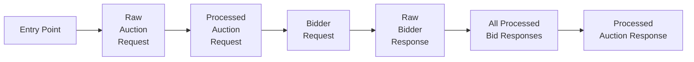

## Prebid Server Flow

```mermaid
flowchart LR
    A[Entry Point] --> B[Raw \nAuction \nRequest]
    B --> C[Processed \nAuction \nRequest]
    C --> D[Bidder \nRequest]
    D --> E[Raw \nBidder \nResponse]
    E --> F[All Processed \nBid Responses]
    F --> G[Processed \nAuction Response]
```
