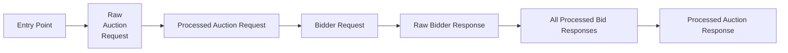

## Prebid Server Flow

```mermaid
flowchart LR
    A[Entry Point] --> B[Raw \nAuction \nRequest]
    B --> C[Processed Auction Request]
    C --> D[Bidder Request]
    D --> E[Raw Bidder Response]
    E --> F[All Processed Bid Responses]
    F --> G[Processed Auction Response]
```
